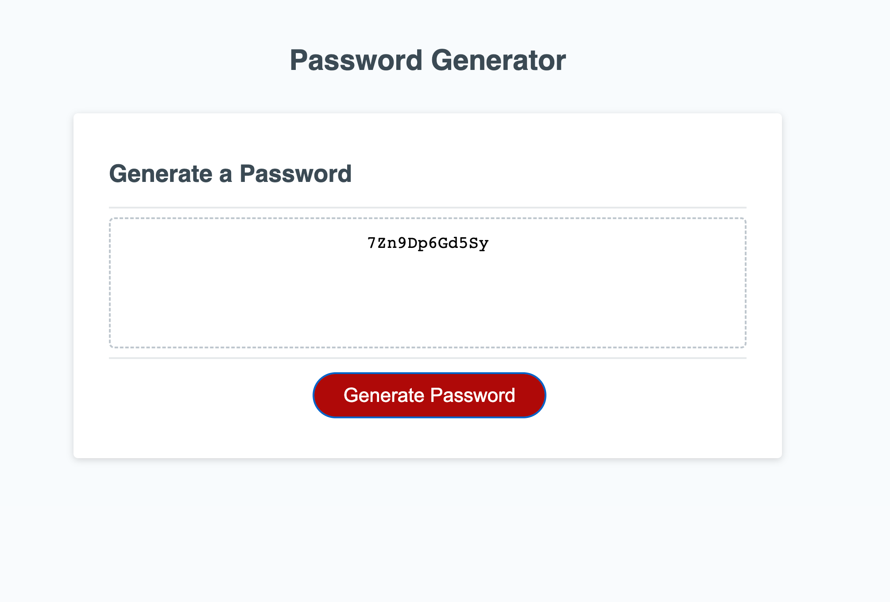
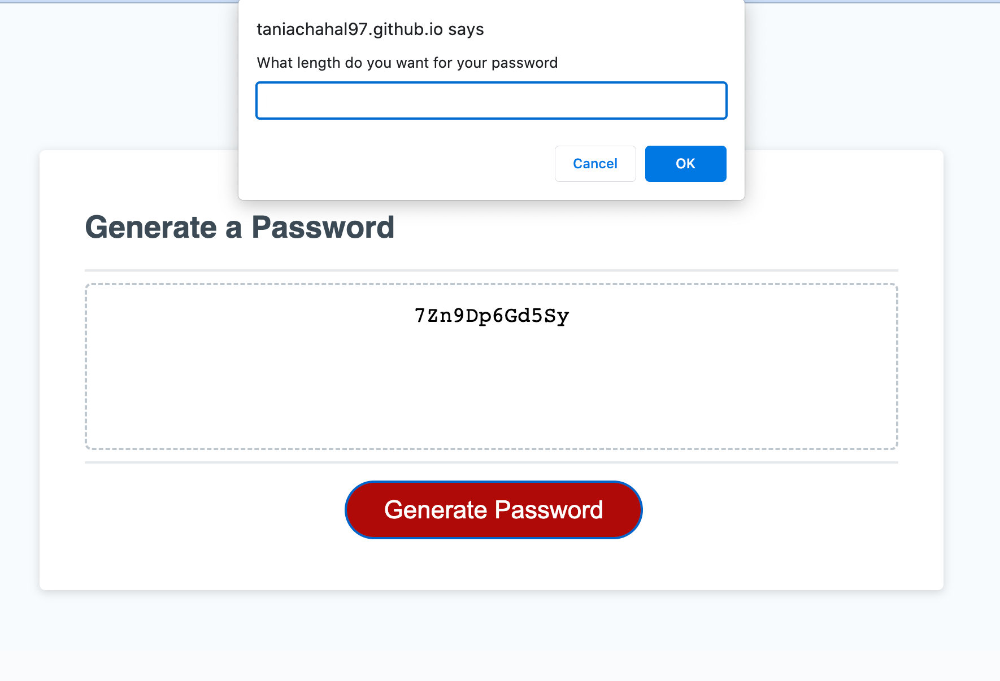

# module-3-challenge
# Random password generator

## Description

The following project generates a random password based on various prompts from user such as password length and character types to be included in the password such as digits, uppercase or lowercase letters or special characters. The user must select a password length of at least 8 characters and no more than 128 characters. An alert message is displayed if the user inputs an invalid password length. In addition the user must select at least one character type to be included in the password. In case, the user does not select any of the character types an alert message is displayed to the user and the password is not generated.

## Installation

Clone the module-3-challenge repository to your local machine. The module-3-challenge folder contains an index.html file, a style.css file and a script.js file. The password generation logic is in the script.js file. 

## Usage

Open the index.html file in VS Code and run the file in the browser to view the webpage. 

## License

Please refer to the license in the repository

## Deployed Application link
https://taniachahal97.github.io/module-3-challenge/